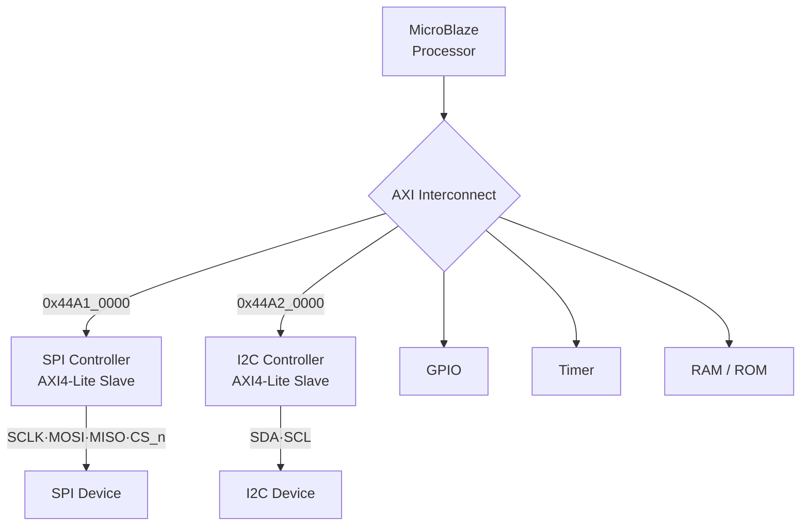

# MicroBlaze SoC — AXI4-Lite SPI·I2C 설계 및 C 펌웨어

> **MicroBlaze 기반 SoC**에 SPI·I2C 통신 컨트롤러를 **AXI4-Lite 슬레이브**로 설계하고,
> Memory-mapped I/O를 제어하는 **bare-metal C 펌웨어**까지 개발한 HW–SW 통합 프로젝트


MicroBlaze 프로세서에 AXI Interconnect로 커스텀 주변장치(SPI·I2C)·GPIO·Timer·RAM/ROM을 연결한
SoC를 FPGA에 구성하고, 각 주변장치를 고정 주소에 메모리맵하여 CPU가 레지스터처럼 접근하도록 설계했습니다.
**RTL 설계 → C 펌웨어 → UVM 검증 → 보드 실증**까지 HW–SW 통합 전 과정을 수행했습니다.

---

## Highlights

- **AXI4-Lite 슬레이브 직접 설계** — SPI·I2C를 5채널 핸드셰이크(AW/W/B/AR/R)로 래핑
- **Bare-metal 펌웨어** — `HW → HAL → Driver → Application` 4계층으로 하드웨어 추상화
- **MMIO 드라이버** — 레지스터 블록을 구조체로 정의, 포인터로 직접 접근 (`SPI0->TX_DATA = data;`)
- **UVM 검증** — self-checking Scoreboard + 기능 커버리지 **100% 달성**
- **양방향 보드 실증** — SPI(Master→Slave)·I2C(Slave→Master) 실제 동작 확인

---

## SoC Architecture



---

## Memory Map

| 주변장치 | Base Address | 설명 |
|----------|:------------:|------|
| **SPI**  | `0x44A1_0000` | 커스텀 SPI 컨트롤러 (AXI4-Lite Slave) |
| **I2C**  | `0x44A2_0000` | 커스텀 I2C 컨트롤러 (AXI4-Lite Slave) |
| GPIO · Timer | 고정 영역 | 입출력 · 타이머 |
| RAM / ROM | 고정 영역 | 데이터 · 명령어 메모리 |

### Slave Register Map (SPI·I2C 공통)

| 레지스터 | 역할 |
|----------|------|
| `CONTROL`  | 통신 시작·모드 제어 |
| `TX_DATA`  | 송신 데이터 (AXI 32bit 중 하위 8bit 사용, 상위 26bit 0 패딩) |
| `STATUS`   | busy 등 상태 플래그 (송수신 동기화용 폴링) |
| `RX_DATA`  | 수신 데이터 |

---

## Firmware — 계층 구조 (Bare-metal C)

```
Application   ─  응용 로직 (버튼·스위치 입력 처리)
   ▲
Driver        ─  SPI/I2C 송수신 함수, STATUS busy 폴링 동기화
   ▲
HAL           ─  하드웨어 추상화 계층 (레지스터 접근 캡슐화)
   ▲
HW (MMIO)     ─  레지스터 블록을 구조체로 정의, 포인터 직접 접근
```

> 예: `SPI0->TX_DATA = data;` 처럼 메모리맵 레지스터를 구조체 포인터로 직접 제어

---

## SPI vs I2C

| 항목 | SPI | I2C |
|------|-----|-----|
| 방식 | 동기식 직렬, **Full-duplex** | 2-wire **Open-drain** (풀업 저항) |
| 통신 확인 | ACK 없음 | 매 바이트 **ACK/NACK** |
| 특성 | 고속·핀 수 많음 | 저핀·저속 |
| 검증 패턴 | `0x55` MOSI 송신 / MISO 수신 | `0x55` 송수신 (파형 검증) |

---

## Verification (UVM)

- **환경 구조** — `test_bench → env → agent → scoreboard · coverage`, interface로 DUT 연결
- **Scoreboard** — `m_rx == s_tx`, `s_rx == m_tx` 비교로 self-checking, 불일치 시 `uvm_error`
- **기능 커버리지** — 대표 패턴 covergroup으로 **커버리지 100% 달성**

---

## Board Demonstration

| 프로토콜 | 방향 | 동작 |
|----------|------|------|
| **SPI** | Master → Slave | Master 버튼 입력 시 Slave의 **FND 숫자 증가** |
| **I2C** | Slave → Master | Slave 스위치 입력 시 Master의 **LED 점등** (양방향 통신) |

---

## Troubleshooting

**SPI — CS race condition**
> Master가 8번째 비트 직후 1clk 만에 CS를 올려, Slave가 마지막 비트를 읽기 전에 통신이 종료되는 문제
> → **CS가 안전하게 올라간 뒤** `rx_data`를 갱신하도록 수정

**I2C — done 신호 유실**
> tick 1clk 후 `done`이 0으로 떨어져 CPU가 완료를 인식하지 못하는 문제
> → `done=1`을 **유지하다가** CPU가 `CONTROL`에 새 명령을 쓸 때 0으로 클리어

---

## Project Structure

```
microblaze-axi-spi-i2c/
├── rtl/        # AXI4-Lite SPI·I2C slave 컨트롤러
├── sw/         # bare-metal C 펌웨어 (HW · HAL · Driver · Application)
├── tb/         # UVM 검증 환경 (env · agent · scoreboard · coverage)
├── sim/        # 시뮬레이션 스크립트
├── docs/       # 발표 자료, 블록 다이어그램
└── README.md
```

---

## Tech Stack

`Verilog HDL` · `AXI4-Lite` · `MicroBlaze SoC` · `SPI / I2C` · `GPIO · Timer` · `Bare-metal C (MMIO)` · `UVM` · `Vivado / Vitis`

---

<div align="center">

**최은수** · [@eunsu1209](https://github.com/eunsu1209)
_팀 프로젝트 · SPI·I2C RTL 설계 및 C 펌웨어 담당_

</div>
